# OULAD - Open University Learning Analytics
## Tools
1. SSIS: Visual Studio 2019, SQL Server
## Dataset
1. Source from: https://analyse.kmi.open.ac.uk/open_dataset
2. **Database schema** <p align = 'center'></p>
3. **Row count** <p align = 'center'>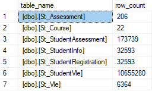</p>
## Data warehouse(DWH) - data mart(DM)
1. **Type of Schema**: Star schema <p align = 'center'>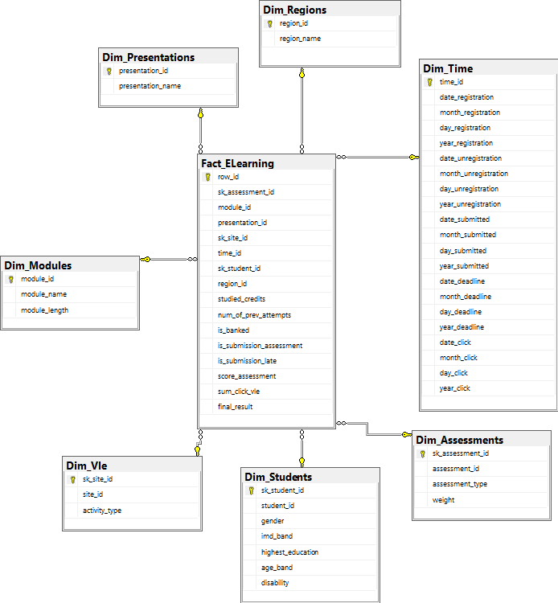</p>
2. **Data flow architecture** <p align = 'center'>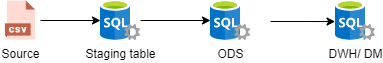</p> <p align = 'center'>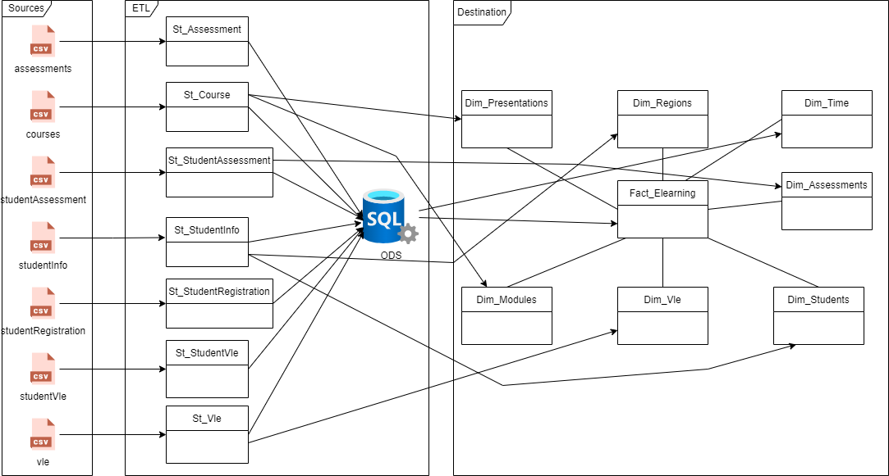</p>
- **Staging table**: Structure of Staging tables are excactly the same sources data, except St_StudentVle have 1 more date_click column. Staging table is stored in Stage_Elearning database.
- **ODS (Operational Data Source)**: ODS is joined from all Staging table. ODS have almost all columns in Staging table. ODS is stored in ODS_Elearning database.
- ** ***NOTE***: I used to create ODS with full data source. It took a long time to finish, my laptop almost froze when I ran it and sometimes my laptop's disk was full. So I decided to split St_StudentVle from about 10m rows to 200k rows with this code:
```
select top (200000)
*
from St_StudentVle
order by date_click
```
This absolutely changed my result, ODS table from storing 100 million rows only has 2 million rows left but I will try to figure out another way to handle full data. sorry for my problem!
## ETL Implementation
I split control flow into 2 packages:
1. **LoadStaging.dtsx**: This package has control flow and data flow for loading from the data source to the staging table.
- Control Flow: <p align = 'center'>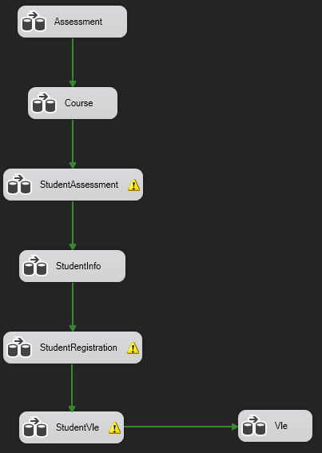</p>
- Data flow for Assessments.csv: <p align = 'center'></p>
- Data flow for Course.csv: <p align = 'center'></p>
- Data flow for StudentAssessment.csv: <p align = 'center'></p>
- Data flow for StudentInfo.csv: <p align = 'center'></p>
- Data flow for StudentRegistration.csv: <p align = 'center'></p>
- Data flow for StudentVle.csv: <p align = 'center'>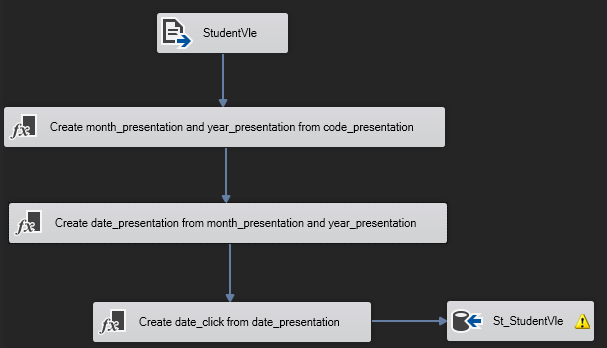</p>
- Data flow for Vle.csv: <p align = 'center'></p>
2. **Load_ODS_DW.dtsx**: This package has control flow and data flow for loading from the the staging table, ODS table to DW.
- Control Flow: <p align = 'center'>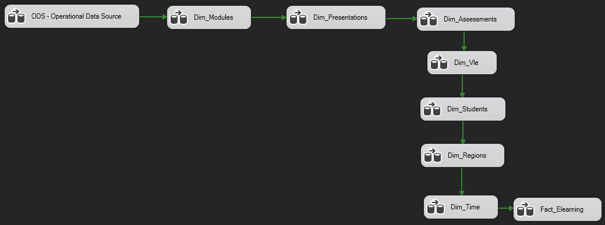</p>
- ODS table: <p align = 'center'>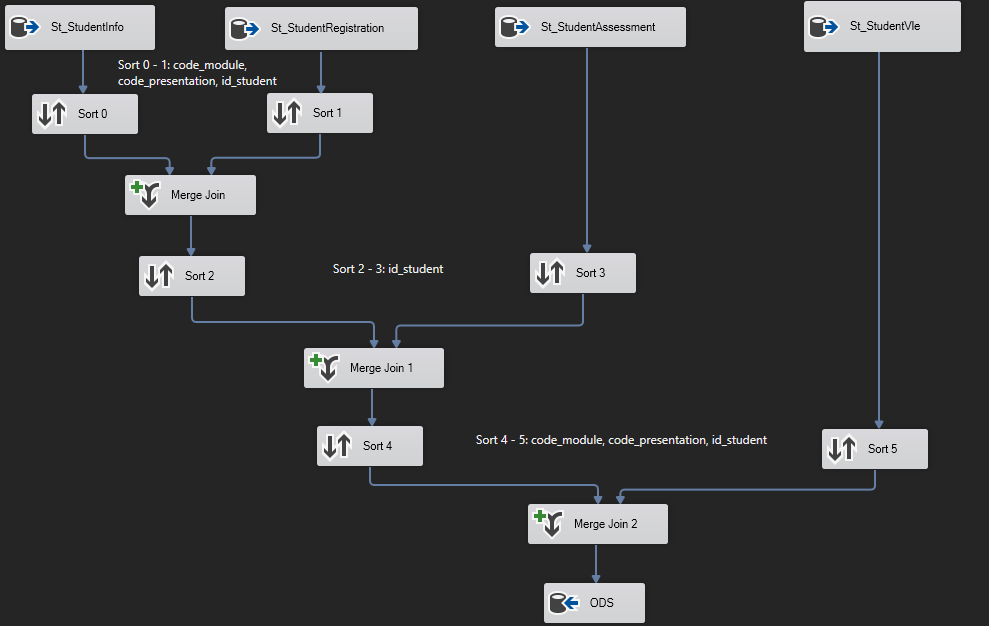</p>
- Dim_Modules: <p align = 'center'>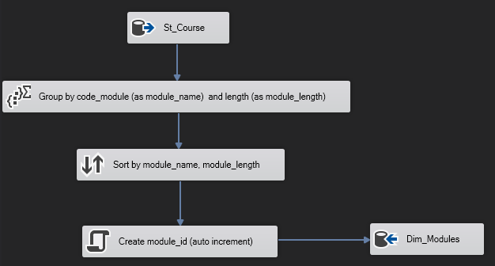</p>
- Dim_Presentations: <p align = 'center'>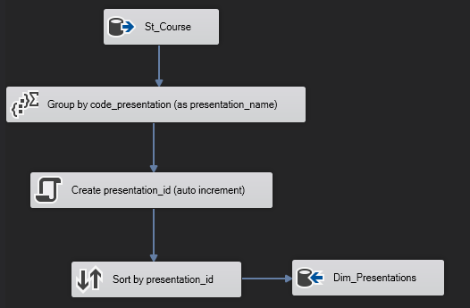</p>
- Dim_Assessments: <p align = 'center'>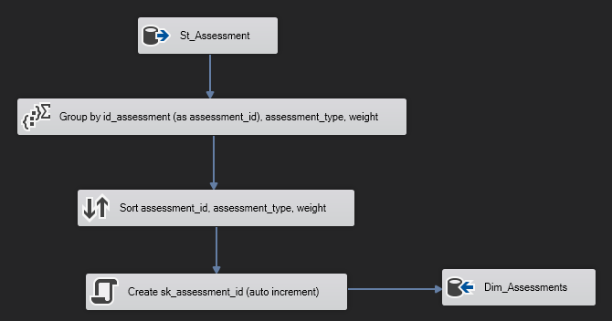</p>
- Dim_Vle: <p align = 'center'>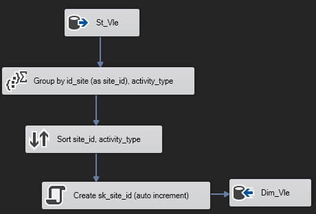</p>
- Dim_Students: <p align = 'center'>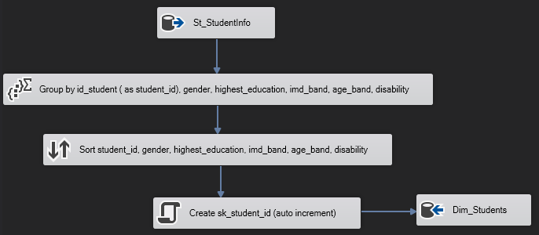</p>
- Dim_Regions: <p align = 'center'>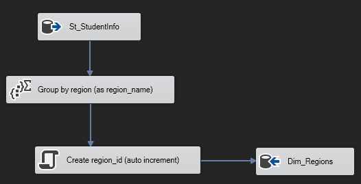</p>
- Dim_Time: <p align = 'center'>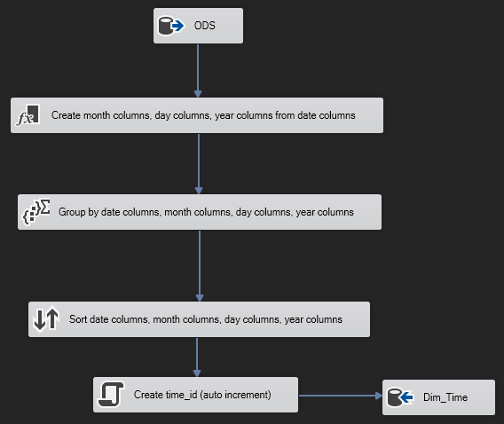</p>
- Fact_Elearning: <p align = 'center'>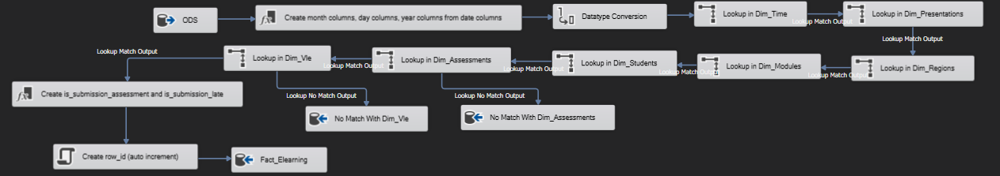</p>
- ** ***NOTE***: I could use ODS for loading all tables in DWH but it takes a long time to finish all tables. Therefore, I just use ODS for some tables that have multiple columns to load(Dim_Time, Fact_Elearning). I also checked the similarity between staging tables and ODS tables to ensure data integrity.
- ** ***NOTE***: According to the description of the database, St_StudentAssessment and St_StudentVle tables don't record student who doesn't submit assessments or doesn't use vle. Therefore, when I load ODS, some students have null values in id_assessment column or id_site column. To fix that problem, I added a line containing only null values in the Dim_Assessment and Dim_Vle tables when loading these tables. this code is into "OLE DB Source" in the data flow of these two tables.
- Dim_Assessment: 
```
SELECT id_assessment, assessment_type, weight
FROM St_Assessment
UNION
SELECT NULL AS Expr1, NULL AS Expr2, NULL AS Expr3
```
- Dim_Vle: 
```
SELECT [id_site]
      ,[activity_type]
  FROM [Stage_Elearning].[dbo].[St_Vle]
  union 
  select null, null
```
## Report
---Updating---
## Prediction
---Updating---
